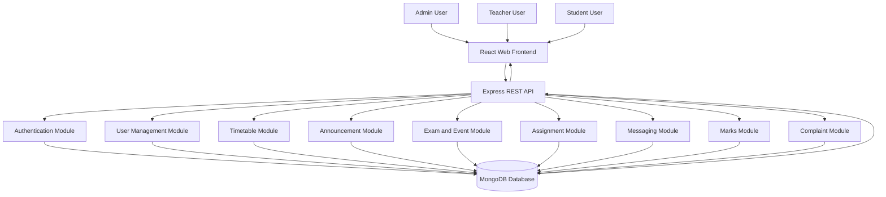
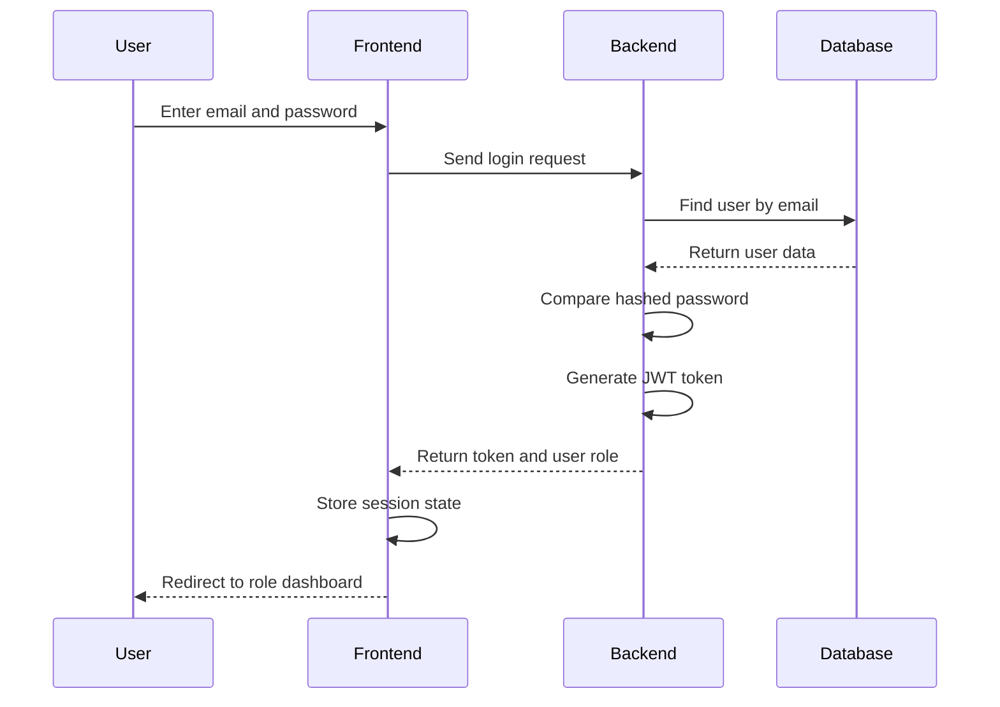
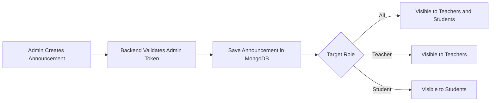
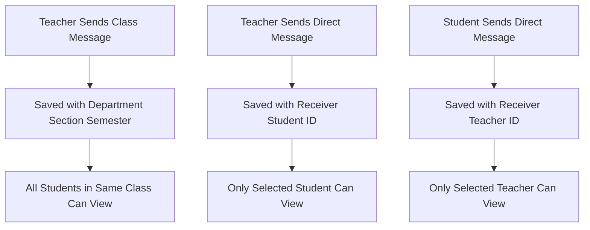
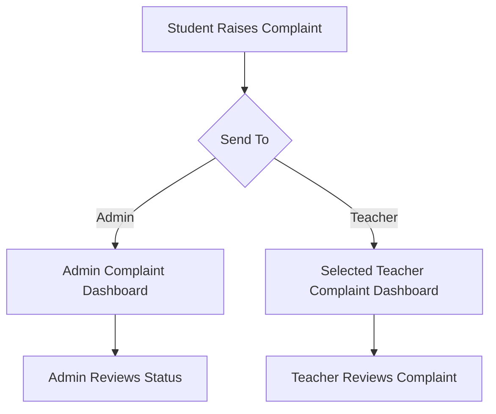
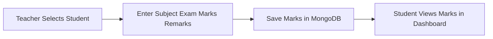

cat > README.md <<'EOF'
# 🎓 CampusConnect — Premium College Management System

CampusConnect is a premium full-stack college management system designed to centralize communication and academic workflows between administrators, teachers, and students. It replaces scattered WhatsApp groups, manual registers, notice boards, informal updates, and untracked complaints with a structured digital platform.

The system provides separate role-based dashboards for Admin, Teacher, and Student users. Each role gets only the features and permissions required for their responsibilities, making the platform secure, organized, and easy to use.

## 🚀 Key Highlights

- Premium web dashboard interface
- Role-based authentication using JWT
- Separate Admin, Teacher, and Student portals
- Admin-controlled announcements, exams, events, timetable, users, and complaints
- Teacher tools for assignments, class messaging, direct student messaging, marks entry, and complaint viewing
- Student tools for assignments, timetable, updates, marks, class chat, direct teacher messaging, and complaints
- Class-wise communication based on department, section, and semester
- Complaint system from student to admin or selected teacher
- Marks entry system for teachers and marks viewing system for students
- MongoDB database with Mongoose models
- REST API architecture using Express.js
- Clean, scalable, major-project-level implementation

## 🧠 Problem Statement

Colleges often depend on disconnected tools such as WhatsApp groups, physical notice boards, spreadsheets, verbal communication, and manual registers. These methods create confusion, missed updates, lack of accountability, and poor academic tracking.

CampusConnect solves this problem by providing one centralized system where administrators, teachers, and students can manage academic communication and college activities in a structured way.

## 🎯 Objectives

- Build a centralized college management system
- Provide secure login for Admin, Teacher, and Student users
- Enable admins to manage academic communication
- Allow teachers to manage assignments, marks, and class communication
- Allow students to access academic information from one dashboard
- Provide direct messaging between teachers and students
- Provide class-wise communication based on section and semester
- Allow students to raise complaints to admin or teacher
- Improve transparency, tracking, and accountability in college workflows

## 👤 User Roles

### Admin

The Admin has complete control over the system.

Admin can:

- View registered users
- Manage timetables
- Post announcements
- Schedule exams
- Add college events
- View student complaints
- Track dashboard statistics

### Teacher

The Teacher manages class-level academic activities.

Teacher can:

- View assigned students
- View timetable
- Create assignments
- View assignment submissions
- Send messages to the entire class
- Send direct messages to individual students
- Enter student marks
- View complaints sent by students

### Student

The Student accesses academic information and communicates with teachers.

Student can:

- View timetable
- View assignments
- Submit assignment answers
- View announcements
- View exams and events
- View marks entered by teachers
- Send direct messages to teachers
- View class messages
- Raise complaints to admin or teacher

## 🛠️ Tech Stack

### Frontend

- React.js
- Vite
- Axios
- Lucide React Icons
- CSS3
- Responsive dashboard UI

### Backend

- Node.js
- Express.js
- MongoDB
- Mongoose
- JWT Authentication
- bcryptjs
- CORS
- dotenv

### Database

- MongoDB local or MongoDB Atlas

### Tools

- VS Code
- Git
- GitHub
- Postman or Thunder Client
- Terminal

## 🏗️ Architecture

## 🔐 Authentication Flow

## 📢 Announcement Flow

## 💬 Messaging Flow

## 📝 Complaint Flow

## 📊 Marks Flow

---

✨ Core Features

Role-Based Dashboard

After login, the system automatically identifies whether the user is Admin, Teacher, or Student and loads the correct dashboard.

User Management

Admin can view all registered users including teachers and students.

Timetable Management

Admin creates timetables based on department, section, semester, day, subject, teacher, room, and time.

Teachers and students only see timetable entries relevant to their department, section, and semester.

Announcements

Admin can post announcements to:

1.All users
2.Teachers
3.Students

Announcements are stored in MongoDB and displayed in the relevant portal.

Exams and Events

Admin can create exam schedules and college events. Students can view relevant exams and events.

Assignments

Teachers can create assignments for their class. Students can view assignments and submit answers.

Messaging

The system supports two types of messages:

1.Class messages
2.Direct messages

Class messages are visible only to users in the same department, section, and semester.

Direct messages are visible only to the selected receiver.

Marks Management

Teachers can select students from their assigned class and enter marks. Students can view their own marks from their dashboard.

Complaint System

Students can raise complaints to:

Admin
Selected teacher

This improves transparency and gives students a safe digital channel for reporting concerns.

⚙️ Installation and Setup

Clone the repository:

git clone git@github.com:rohanramgopal/CampusConnect.git
cd CampusConnect

Install backend dependencies:

cd backend
npm install

Create environment file:

cat > .env <<'ENV'
PORT=5001
MONGO_URI=mongodb://127.0.0.1:27017/campusconnect
JWT_SECRET=campusconnect_super_secret_key
ENV

Start backend:

npm run dev

Open another terminal and install frontend dependencies:

cd frontend
npm install

Start frontend:

npm run dev

Open the app:

http://localhost:5173

Backend runs on:

http://localhost:5001

👥 Demo Users

Run seed command inside backend:

cd backend
npm run seed

Then login using:

Admin
Email: admin@campus.com
Password: 123456
Teacher
Email: teacher@campus.com
Password: 123456
Student
Email: student@campus.com
Password: 123456

🧪 API Testing

You can test backend APIs using Postman or Thunder Client.

Base API URL:

http://localhost:5001/api

Main API groups:

/api/auth
/api/admin
/api/teacher
/api/student
🔒 Security Features
Password hashing using bcryptjs
JWT-based authentication
Role-based route protection
Admin-only protected APIs
Teacher-only protected APIs
Student-only protected APIs
Controlled access to class-specific data
Direct messages restricted by receiver ID

---

🌟 Why This Project Stands Out

CampusConnect is not just a basic CRUD project. It includes real academic workflows such as class-based communication, role-based access, assignment submission, marks entry, complaint routing, announcements, exams, events, and timetable management.

It demonstrates practical full-stack development skills including:

REST API design
Authentication and authorization
Database modeling
Frontend state management
Role-based UI rendering
Real-world module separation
Academic workflow automation
Scalable project architecture

---

🚀 Future Enhancements
Attendance tracking
Firebase push notifications
Parent portal
File upload for assignments
Admin analytics dashboard
Teacher-to-admin messaging
Complaint escalation workflow
Student performance charts
Department-wise analytics
Multi-college support
Deployment on Render and Vercel
Android mobile app version

---

📌 Use Cases
Engineering colleges
Degree colleges
Diploma colleges
Schools
Coaching institutes
Training centers
Internal academic communication systems

---

🧾 Conclusion

CampusConnect provides a complete digital solution for managing college communication and academic workflows. It improves transparency, reduces communication gaps, and creates a centralized platform for students, teachers, and administrators.

This project is suitable as a major academic project, portfolio project, and full-stack development demonstration.

---

👨‍💻 Author

Rohan Ramgopal
